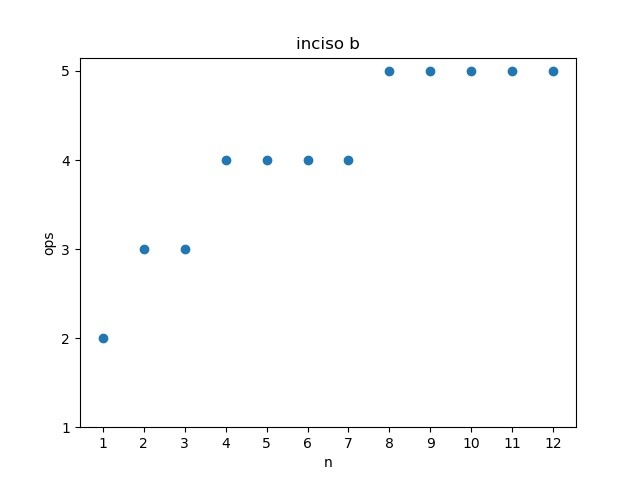
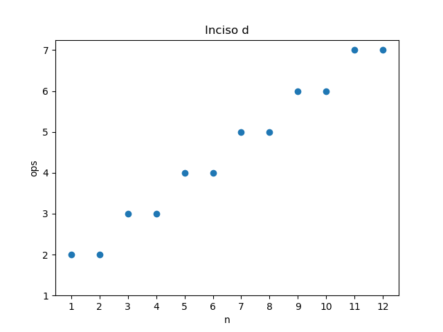

## (a)

```C
t := 1
while  t < n do  
	t := t ∗ 2
od
```

Hacemos una tabla para algunos valores de n, nos servirá para saber el número de operaciones realizadas y cómo crece la variable t

|	n 		| 	 1   |    2   |   3   |   4    |   5    |   6    |   7    |   8    |    9    |    10   |    11   |    12   |
|-----------|--------|--------|-------|--------|--------|--------|--------|--------|---------|---------|---------|---------|
|	t       |    1   |    2   |   4   |   4    |   8    |   8    |   8    |   8    |   16    |   16    |    16   |   16    |
|	ops     |    1   |    2   |   3   |   3    |   4    |   4    |   4    |   4    |    5    |    5    |    5    |    5    |


Al graficar los puntos n en la abscisa y los puntos ops en la ordenada


Podemos observar que la gráfica se aproxima a la función logaritmo de donde concluimos ***Ө(Log(n))***  

- La  relación entre t y ops es: ***t = 2<sup>ops - 1</sup>***  

- Mientras que t y n son proporcionales, crecen al mismo ritmo ***n ~ t***


## (b)

```C
t := n
do t > 0
	t := t div 2
od
```

Haciendo la tabla  

|	n 		| 	 1   |    2   |   3   |   4    |   5    |   6    |   7    |   8    |    9    |    10   |    11   |    12   |
|-----------|--------|--------|-------|--------|--------|--------|--------|--------|---------|---------|---------|---------|
|	t       |    0   |    0   |   0   |   0    |   0    |   0    |   0    |   0    |    0    |    0    |    0    |    0    |
|	ops     |    2   |    3   |   3   |   4    |   4    |   4    |   4    |   5    |    5    |    5    |    5    |    5    |

Graficando  

  

Concluimos ***Ө(Log(n))***

## (c)

```C
for i := 1 to n do
	t := i
	do t > 0
		t := t div 2
	od
od
```
Por el inciso anterior sabemos que el while anidado es ***Ө(Log(n))***, por lo tanto basta calcular ops(for do ... od)
 
Luego  
ops(**for** i≔1 **to** n **do** (t ≔ i **do** ...i… **od**) **od** )  
={ Def de ops en for}  
〈 ∑ i : 1 ≤ i ≤ n : ops(t≔i **do** ..i.. **od**) 〉   
={ Def de ops en asignación, además sabemos que ops(**do** .. n .. **od**) = log(n) por el inciso b }  
〈 ∑ i : 1 ≤ i ≤ n : 1 + Log(i) 〉  
={ Propiedad de log }  
n + Log(n!)  

⇒  **Ө(Log(n!))**

## (d)

```C
for i := 1 to n do
	t := i
	do t > 0
		t := t − 2
	od
od
```
Primero calculamos el orden de while anidado, i.e.

```C
t := i
do t > 0
	t := t − 2
od
```
Hacemos la tabla  

|	n 		| 	 1   |    2   |   3   |   4    |   5    |   6    |   7    |   8    |    9    |    10   |    11   |    12   |
|-----------|--------|--------|-------|--------|--------|--------|--------|--------|---------|---------|---------|---------|
|	t       |   -1   |    0   |  -1   |   0    |  -1    |   0    |  -1    |   0    |   -1    |    0    |   -1    |    0    |
|	ops     |    2   |    2   |   3   |   3    |   4    |   4    |   5    |   5    |    6    |    6    |    7    |    7    |

Graficando 

  

Concluimos **Ө(n)** orden lineal

Luego aplicamos ops a todo el for  

ops(**for** i≔1 **to** n **do** (t ≔ i **do** ...i… **od**) **od** )  
={ Def de ops en for }  
〈 ∑ i : 1 ≤ i ≤ n : ops(t≔i **do** ..i.. **od**) 〉   
={ Def de ops en asignación, además sabemos que ops(**do** .. n .. **od**) = n }  
〈 ∑ i : 1 ≤ i ≤ n : 1 + i 〉  
={ Regla del termino }  
〈 ∑ i : 1 ≤ i ≤ n : 1 〉+ 〈 ∑ i : 1 ≤ i ≤ n : i 〉  
= { Propiedad 〈 ∑ i : 1 ≤ i ≤ n : 1 〉 = n }  
n + 〈 ∑ i : 1 ≤ i ≤ n : i 〉  
= { Numero Triangular }  
n + [n(n+1)]/2  
={ Distributividad del producto con respecto a la suma }  
n + n<sup>2</sup>/2 + n/2  
={ Del mismo orden }
n<sup>2</sup>  

 ⇒ Ө(n<sup>2</sup>) 
