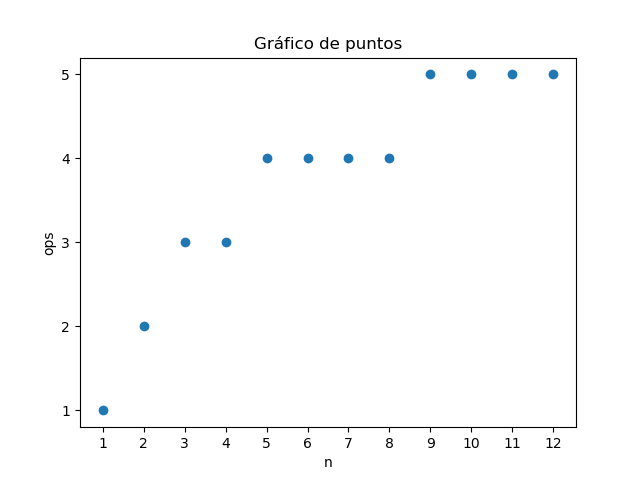

## (a)

```C
t := 1
while  t < n do  
	t := t ∗ 2
od
```

Hacemos una tabla para algunos valores de n, nos servirá para saber el número de operaciones realizadas y cómo crece la variable t

|	n 		| 	 1   |    2   |   3   |   4    |   5    |   6    |   7    |   8    |    9    |    10   |    11   |    12   |
|-----------|--------|--------|-------|--------|--------|--------|--------|--------|---------|---------|---------|---------|
|	t       |    1   |    2   |   4   |   4    |   8    |   8    |   8    |   8    |   16    |   16    |    16   |   16    |
|	ops     |    1   |    2   |   3   |   3    |   4    |   4    |   4    |   4    |    5    |    5    |    5    |    5    |


Al graficar los puntos n en la abscisa y los puntos ops en la ordenada



Podemos observar que la gráfica se aproxima a la función logaritmo de donde concluimos ***Ө(Log(n))***  

- La  relación entre t y ops es: ***t = 2<sup>ops - 1</sup>***  

- Mientras que t y n son proporcionales, crecen al mismo ritmo ***n ~ t***


## (b)

```C
t := n
do t > 0
	t := t div 2
od
```

Haciendo la tabla  

|	n 		| 	 1   |    2   |   3   |   4    |   5    |   6    |   7    |   8    |    9    |    10   |    11   |    12   |
|-----------|--------|--------|-------|--------|--------|--------|--------|--------|---------|---------|---------|---------|
|	t       |    0   |    0   |   0   |   0    |   0    |   0    |   0    |   0    |    0    |    0    |    0    |    0    |
|	ops     |    2   |    3   |   3   |   4    |   4    |   4    |   4    |   5    |    5    |    5    |    5    |    5    |

Graficando  

  

Concluimos ***Ө(Log(n))***
